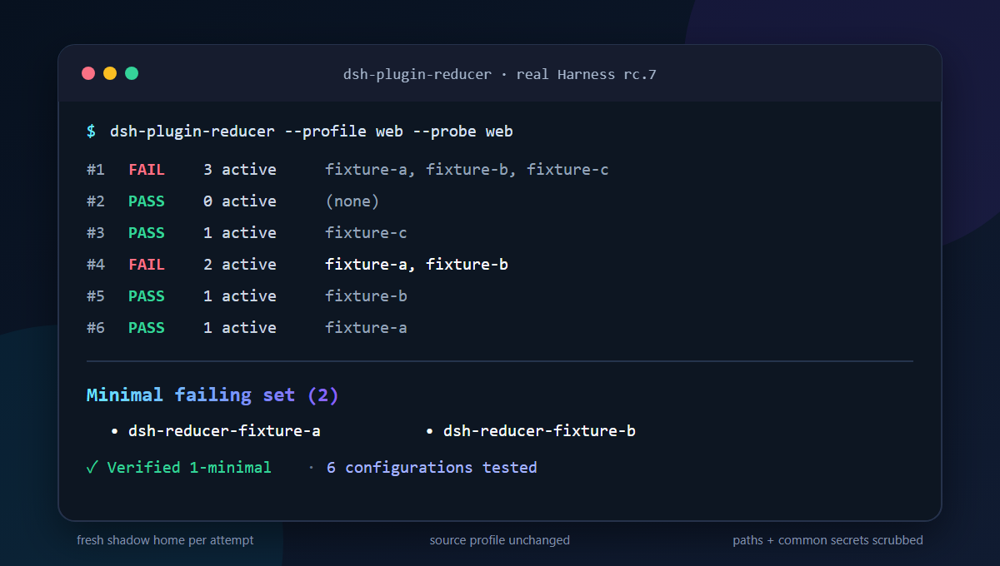

# dsh-plugin-reducer

[English](README.md)

**DeepSeek Harness 的 profile 坏了，究竟哪几个插件才是复现故障所必需的？**

`dsh-plugin-reducer` 是一个非官方、运行在 Harness 之外的诊断工具。它会在一次性
影子 profile 中自动测试插件组合，找出导致故障的 **1-最小插件集合**，不靠修改
真实 profile 来试错。



它尤其适合定位普通“逐个禁用”会漏掉的交互故障：A 单独正常，B 单独正常，A+B
才崩，最终结果就是 `{A, B}`。

> 当前是早期预览版：已在 Windows + Node.js 24 上用
> `@deepseek-ai/dsh@0.1.0-rc.7` 完成真实启动验证；CI 面向 Windows、macOS、Linux
> 和 Harness 支持的 Node.js 版本。

遇到了真实的 profile 故障？欢迎提交一份[经过人工检查和脱敏的现场报告](https://github.com/ArmyWas/dsh-plugin-reducer/issues/new?template=field-report.yml)。

## 为什么值得做

现有生态里已有启动保护、医生、复现信息导出、插件管理等优秀项目，但它们没有
直接回答一个更窄、却很关键的问题：

> 我最少需要把哪几个插件交给作者，才能稳定复现这个故障？

这个工具把一个庞大、私有的 profile，压缩为小而有证据的插件集合，并生成适合
贴到 Issue 的脱敏 JSON 报告。

## 快速开始

直接安装经过验证的 GitHub Release，无需克隆仓库或本地构建：

```sh
npm install --global https://github.com/ArmyWas/dsh-plugin-reducer/releases/download/v0.3.0/dsh-plugin-reducer-0.3.0.tgz
dsh-plugin-reducer --profile web --probe web --report reducer-report.json
```

卸载命令是 `npm uninstall --global dsh-plugin-reducer`。当前尚未发布到 npm
registry，因此请使用固定版本的 Release 地址，不要使用未固定的 `npx` 命令。

参与源码开发时：

```sh
git clone https://github.com/ArmyWas/dsh-plugin-reducer.git
cd dsh-plugin-reducer
npm install
npm test
npm link
dsh-plugin-reducer --profile web --probe web --report reducer-report.json
```

如果 `dsh` 不在 `PATH` 中：

```sh
dsh-plugin-reducer --dsh /path/to/dsh --profile web --probe web
```

工具默认读取环境变量中的 `DSH_HOME`，也可显式传入 `--dsh-home`。

## 机器集成

其他工具需要稳定接口而不是终端文案时，请使用 `--json`。命令只向
stdout 写一行 JSON 信封、隐藏进度输出，并保留现有退出码语义：

```sh
dsh-plugin-reducer --json --dsh-home /path/to/.dsh \
  --profile web --probe web
```

成功时，脱敏报告位于 `report`，最小故障集位于
`report.result.minimalFailingSet`。参数错误退出 `2`；执行或归约失败退出
`1`；两种失败仍会返回可解析的 `ok: false` 信封与稳定的
`error.code`。`--list-candidates --json` 使用同一信封系列，JSON Schema
随包发布在 `schemas/`。

Node 集成可以直接导入 `reduceProfile`，完全绕开可执行文件发现。CLI、
库接口、退出码、跨平台临时目录和 Windows 注意事项见
[集成契约](docs/INTEGRATION.md)。集成端不应依赖 `which`、shell 字符串拼接
或硬编码 `/tmp`。可直接复制运行的固定版本示例位于
[`examples/node-consumer`](examples/node-consumer/README.md)。

## 列出候选插件

在消耗探针运行次数之前，先看看 reducer 会考虑哪些树外插件。
`--list-candidates` 读取 profile manifest，每行打印一个 bundle 名称并以 0 退出：

```sh
dsh-plugin-reducer --list-candidates --profile web
```

```text
plugin-a
plugin-b
plugin-c
```

这是只读操作：它不创建影子 `DSH_HOME`，不运行任何探针，也不要求 `dsh` 可执行
文件已安装或位于 `PATH` 中。探针专用参数和 `--` 后的命令会直接被拒绝，不会被
悄悄忽略。

## 一次运行做了什么

1. 读取 `$DSH_HOME/profiles/<name>/package.json`。
2. 将同时存在于 `dsh.profile.bundles` 与 `dependencies` 中的包视为可缩减的树外
   插件；Harness 内置 bundle 始终保留。
3. 每次探针都建立全新的临时影子 `DSH_HOME`，链接已经安装好的 `node_modules`，
   不重新安装任何包。
4. 通过 delta debugging 测试子集与补集。
5. 对结果中的每个插件做一次移除验证。
6. 可选输出经过密钥和本机路径脱敏的 JSON 报告。

示例：

```text
Minimal failing set (2):
  - plugin-a
  - plugin-b
Verified 1-minimal: yes; 6 configuration(s) tested.
```

“1-最小”表示结果中任意移除一个插件，故障都不再复现；它不等于数学意义上的
“全局最小集合”。

## 三种探针

| 探针 | 通过条件 | 适用问题 |
| --- | --- | --- |
| `config`（默认） | `dsh --dump-config` 返回 0 | manifest 与配置层组合错误 |
| `web` | 随机本地端口可访问，且稳定度过观察窗口 | 插件加载和启动崩溃 |
| 自定义命令 | 你提供的命令返回 0 | 精确测试某个回归或工作流 |

自定义命令写在 `--` 后面，它会收到指向影子目录的 `DSH_HOME`：

```sh
dsh-plugin-reducer --profile web --timeout 60000 -- node reproduce.mjs
```

探针应当只在目标故障确实复现时返回非 0；其他命令错误也会被视为故障，因此脚本
条件要尽量精确。

间歇性问题可以重复每种组合。结果不一致时会标记为 `unresolved`，不会被当作
删除插件的证据：

```sh
dsh-plugin-reducer --profile web --probe web --repeat 3 --max-trials 512
```

完整参数请运行 `dsh-plugin-reducer --help`。

加入 `--keep-lab` 可保留一份只启用最终最小集合的干净影子目录，便于人工检查；
各次探针使用的临时目录仍会被删除。

## 安全边界

- 工具自身只改临时影子目录中的候选列表。
- 每次探针使用全新影子目录，避免前一个组合写下的状态污染后一个组合。
- 运行前后会对真实 profile 的 manifest 与 patch 做指纹比对。
- 复用现有依赖，不调用包管理器，不执行安装脚本。
- 不复制 `.env`、会话、存储或工作区数据。
- 报告会替换已知本机根路径和其他绝对路径，并清理常见 token 与疑似密钥字段。

它是诊断隔离工具，**不是安全沙箱**。已安装插件和自定义探针仍以当前用户权限
运行，可能访问网络、继承的环境变量，以及正常 Harness 运行时本就能访问的文件。
运行不可信代码前请阅读 [SECURITY.md](SECURITY.md)。

## 明确的能力边界

- 故障必须能在影子 profile 中稳定复现。
- 内置 bundle、profile patch、home patch 保持固定；如果移除全部树外插件后仍
  失败，工具会以 `BASELINE_FAILS` 停止。
- 仅作为库安装、但没有列入 bundle 层的包，不属于候选集合。
- Web 探针验证“启动可用”，不等于验证完整对话流程。
- 算法保证 1-最小，不承诺找到所有可能集合中的全局最小值。

## 与现有项目的关系

| 项目 | 核心工作 | 与本项目的分工 |
| --- | --- | --- |
| [dsh-startup-guard](https://github.com/aokamoaki/dsh-startup-guard) | 启动预检、快照、修复、隔离 | 先恢复可用，再把稳定故障交给 reducer 缩减 |
| [dsh-boot-guard](https://github.com/SaiSenBox/dsh-boot-guard) | 不依赖 loader 的人工救援和跳过插件 | 恢复控制权，不自动搜索交互组合 |
| [dsh-repro](https://github.com/EvilIrving/dsh-repro) | 导出脱敏会话、失败命令和 git diff | 收集会话上下文；本项目缩减 profile 插件 |
| [dsh-builtin-toggles](https://github.com/Starfie1d1272/dsh-builtin-toggles) | 检查和切换内置能力 | 面向运行时检查，不面向故障集合搜索 |

完整检索过程见[生态审查](docs/ECOSYSTEM_REVIEW.md)。目标是补位，而不是取代这些
项目。

## 证据与设计资料

- [真实 Harness 交互故障测试](docs/REAL_HARNESS_TEST.md)
- [使用真实 Harness 开发 `--list-candidates` 的实测报告](docs/HARNESS_DOGFOOD.md)
- [产品说明](docs/PRODUCT.md)
- [报告 JSON Schema](schemas/dsh-plugin-reducer-report.schema.json)
- [机器输出 JSON Schema](schemas/dsh-plugin-reducer-machine-output.schema.json)
- [集成契约](docs/INTEGRATION.md)
- [上游 RFC](docs/UPSTREAM_RFC.md)
- [社区发布材料](docs/COMMUNITY_LAUNCH.md)
- [GitHub 发布运行手册](docs/PUBLISH_RUNBOOK.md)
- [官方 Discussion 定稿](docs/OFFICIAL_DISCUSSION.md)
- [v0.1.0 发布说明](docs/RELEASE_NOTES_v0.1.0.md)
- [v0.2.0 发布说明](docs/RELEASE_NOTES_v0.2.0.md)
- [v0.3.0 发布说明](docs/RELEASE_NOTES_v0.3.0.md)
- [参与贡献](CONTRIBUTING.md)

DeepSeek Harness 是其权利人的商标。本项目与 DeepSeek 无隶属或官方背书关系。
